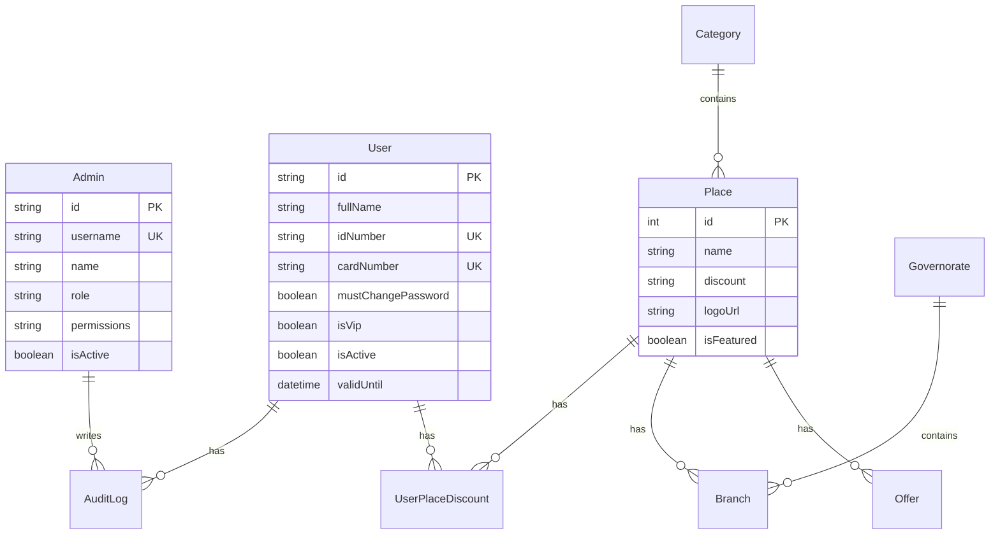

# Database Diagram

```mermaid
erDiagram
  Admin ||--o{ AuditLog : writes
  User ||--o{ AuditLog : has
  User ||--o{ UserPlaceDiscount : has
  Place ||--o{ UserPlaceDiscount : has
  Category ||--o{ Place : contains
  Place ||--o{ Branch : has
  Governorate ||--o{ Branch : contains
  Place ||--o{ Offer : has

  Admin {
    string id PK
    string username UK
    string name
    string role
    string permissions
    boolean isActive
  }
  User {
    string id PK
    string fullName
    string idNumber UK
    string cardNumber UK
    boolean mustChangePassword
    boolean isVip
    boolean isActive
    datetime validUntil
  }
  Place {
    int id PK
    string name
    string discount
    string logoUrl
    boolean isFeatured
  }
```
