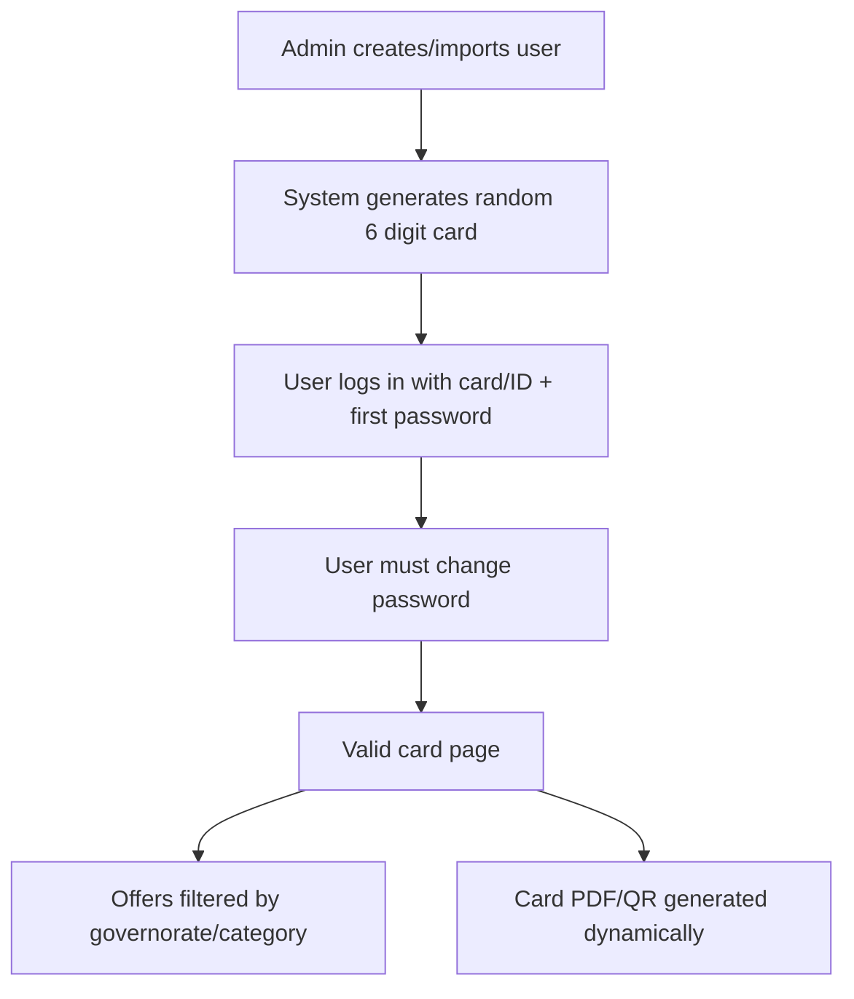

# Workflow

```mermaid
flowchart TD
  A[Admin creates/imports user] --> B[System generates random 6 digit card]
  B --> C[User logs in with card/ID + first password]
  C --> D[User must change password]
  D --> E[Valid card page]
  E --> F[Offers filtered by governorate/category]
  E --> G[Card PDF/QR generated dynamically]
```
